## Database
### Build : 

`docker build . -t part1tp1`

### run : 

`docker run -p 5432:5432 --name tp1bdd part1tp1`

### create network : 

`docker network create app-network`

### restart the admiter:
```
docker run \
    -p "8090:8080" \
    --net=app-network \
    --name=adminer \
    -d \
    adminer
```

With admiter, it's possible to visualize our DB 
So go to adminer and enter informations : 
- Postgres
- tp1bdd:5432
- usr
- pwd
- db

Update dockerfile to initiate DB with data : 

`COPY *.sql /docker-entrypoint-initdb.d`

then re run yout DB : 

`docker run -p 5432:5432 --name tp1bdd --network app-network part1tp1`

Volume : 

`sudo docker run -p 5432:5432 -v /opt/data-save:/var/lib/postgresql/data --network app-network -d --name tp1bdd part1tp1`

## Partie JAVA : 

Write another docker file :
```docker
FROM maven:latest

COPY Main.class .
RUN java Main 
```

then build  with the docker file
`docker build -t tp1java . -f java.dockerfile`

then run the image : 
`docker run --name tp1java tp1java`

Here you sould see the Hello world

## Spring project: 
after generating the projeect and build it with the dockerfile in we can run it with the command below in the simpleapi folder:

`docker run -p 8080:8080 --name simpleapi simpleapi`


To link the database to our project, we have to complete the application.yml

```yml
spring:
  jpa:
    properties:
      hibernate:
        jdbc:
          lob:
            non_contextual_creation: true
    generate-ddl: false
    open-in-view: true
  datasource:
    url: jdbc:postgresql://tp1bdd:5432/db
    username: usr
    password: pwd
    driver-class-name: org.postgresql.Driver
management:
 server:
   add-application-context-header: false
 endpoints:
   web:
     exposure:
       include: health,info,env,metrics,beans,configprops
```

then :

place yourself into the right folder : 
`docker run -p 8080:8080 --name simpleapistud --network app-network simpleapistud`


## HTTP : 
after creating a folder with a dockerfile in it and another folder containing our index.html we can build and run it : 

`docker build -t http . -f http.dockerfile`

`docker run -p 80:80 --name http --network app-network http`

## Reverse proxy : 
Add a conf file httpd.conf at the base of the folder http :

```
<VirtualHost *:80>
ProxyPreserveHost On
ProxyPass / http://simpleapistud:8080/
ProxyPassReverse / http://simpleapistud:8080/
</VirtualHost>
LoadModule proxy_module modules/mod_proxy.so
LoadModule proxy_http_module modules/mod_proxy_http.so
```

then modify the docker file :
``` docker
FROM httpd:latest
COPY ./httpd.conf /usr/local/apache2/conf/httpd-custom.conf
COPY ./public-html/ /usr/local/apache2/htdocs/
RUN echo "Include ./conf/httpd-custom.conf" >> /usr/local/apache2/conf/httpd.conf
```

## Docker compose: 

```yml
version: '3.8'

services:
  backend:
    container_name: simpleapistud
    build:
      context: ./simple-api-student-main
      dockerfile: java.dockerfile
    networks:
      - tp1
    depends_on:
      - database

  database:
    container_name: tp1bdd
    build: ./
    networks:
      - tp1
    volumes:
      - db:/var/lib/postgresql/data

  httpd:
    build:
      context: ./http
      dockerfile: http.dockerfile
    ports:
      - "80:80"
    networks:
      - tp1
    depends_on:
      - backend

networks:
  tp1:

volumes:
  db:
```

After that, just build and up your components and it will work

`docker compose build`

`docker compose up -d`

## Questions : 

### 1-1 Document your database container essentials: commands and Dockerfile.

Already documented in the readme. 

### 1-2 Why do we need a multistage build? And explain each step of this dockerfile.

It's important to have a multistage build to save more ressources. Let's take the exemple of a java code in a container. Multistage build will take a jdk and a jre, use the jdk to compile and then get rid of it to keep only the essential part witch is the .jar and the jre to execute it.

Contrary to a classic build which will juste take and keep all the resources from build the execution. 

### 1-3 Document docker-compose most important commands. 

`docker compose build` => to build your containers and gather all informations necessary

`docker compose up -d` => to wake up your builded container and run them

### 1-4 Document your docker-compose file.

we use 3 services with 1 network and a volume for the database. Each service is link to a dockerfile, a context, a network and also if necessary a dependence. 

# Part 2 - github Actions

## What are testcontainers?
These are lightweight libraries with API for completing integration tests with services wrapped in Docker containers

## CI

The first step is to create the `.github/workflows` repository and make sur that the maven tests are ok on the simple-api-student-main folder.

Then we must fill out the main.yml file : 

```yml
name: CI devops 2023
on:
  #to begin you want to launch this job in main and develop
  push:
    branches: [master, develop] 
  pull_request:

jobs:
  test-backend: 
    runs-on: ubuntu-22.04
    steps:
     #checkout your github code using actions/checkout@v2.5.0
      - uses: actions/checkout@v2.5.0

     #do the same with another action (actions/setup-java@v3) that enable to setup jdk 17
      - name: Set up JDK 17
        uses: actions/setup-java@v3
        with:
          java-version: 17
          distribution: 'temurin'

     #finally build your app with the latest command
      - name: Build and test with Maven
        run: mvn clean verify --file simple-api-student-main/pom.xml
```
After pushing on git, we can see that all tests are ok ! 
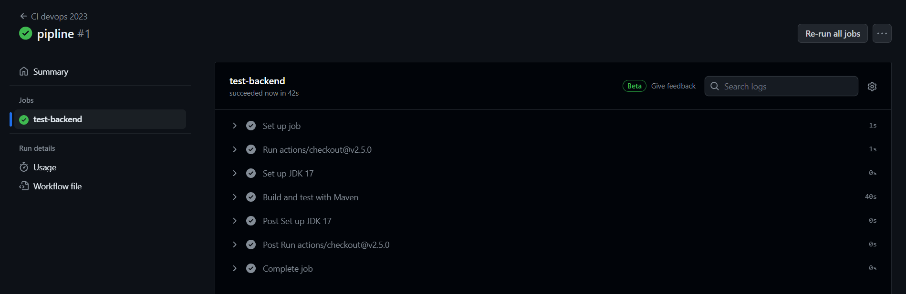


## CD

Next step is to pusblish on dockerHub, we must change the main.yml to adatpt to that and create 2 secrets in our docker repository 

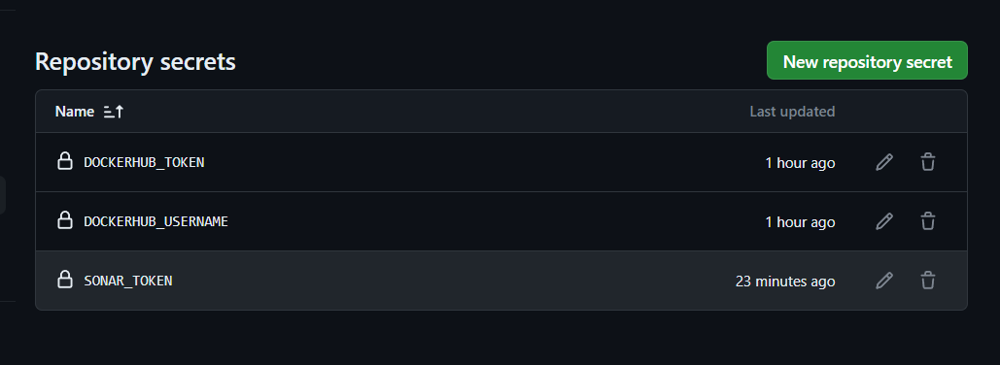

then we modify the main.yml

```yml
  # define job to build and publish docker image
  build-and-push-docker-image:
    needs: test-backend
    # run only when code is compiling and tests are passing
    runs-on: ubuntu-22.04

    # steps to perform in job
    steps:
      - name: Checkout code
        uses: actions/checkout@v2.5.0

      - name: Login to DockerHub
        run: docker login -u ${{ secrets.DOCKERHUB_USERNAME }} -p ${{ secrets.DOCKERHUB_TOKEN }}

      - name: Build image and push backend
        uses: docker/build-push-action@v3
        with:
          # relative path to the place where source code with Dockerfile is located
          context: ./simple-api-student-main
          # Note: tags has to be all lower-case
          tags: ${{secrets.DOCKERHUB_USERNAME}}/tp2-devops-simple-api-student-main:latest
          # build on feature branches, push only on main branch
          push: ${{ github.ref == 'refs/heads/master' }}

      - name: Build image and push database
        uses: docker/build-push-action@v3
        with:
          context: ./dataBase

          tags: ${{secrets.DOCKERHUB_USERNAME}}/tp2-devops-database:latest
          push: ${{ github.ref == 'refs/heads/master' }}

      - name: Build image and push httpd
        uses: docker/build-push-action@v3
        with:
          context: ./http

          tags: ${{secrets.DOCKERHUB_USERNAME}}/tp2-devops-http-front:latest
          push: ${{ github.ref == 'refs/heads/master' }}
```

In this code, we specify each step to push our containers in dockerhub to have a continuous deployement. Of course this is only possible if our tests passed. After the login, we push each image independently using our secrets keys defined before. 

After pushing, we can see that everithing is ok ! 
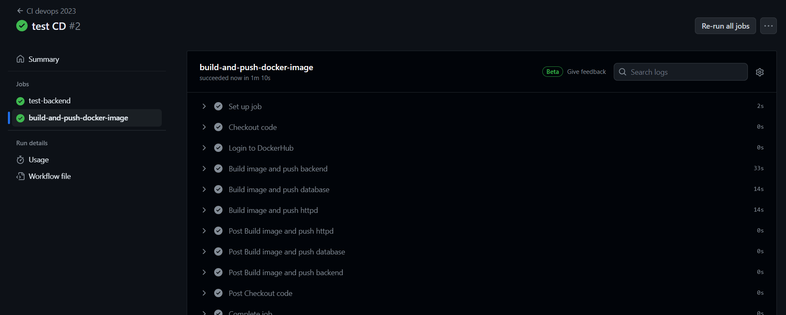

## Sonar

After creating the acount and adding our github project, we must create a SONAR_TOKEN in the github secrets

then there a line to modify in our main.yml : 

` run: mvn -B verify sonar:sonar -Dsonar.projectKey=scorpion6912_devops-CPE -Dsonar.organization=scorpion6912 -Dsonar.host.url=https://sonarcloud.io -Dsonar.login=${{ secrets.SONAR_TOKEN }}  --file ./simple-api-student-main/pom.xml`

then push the changes : 

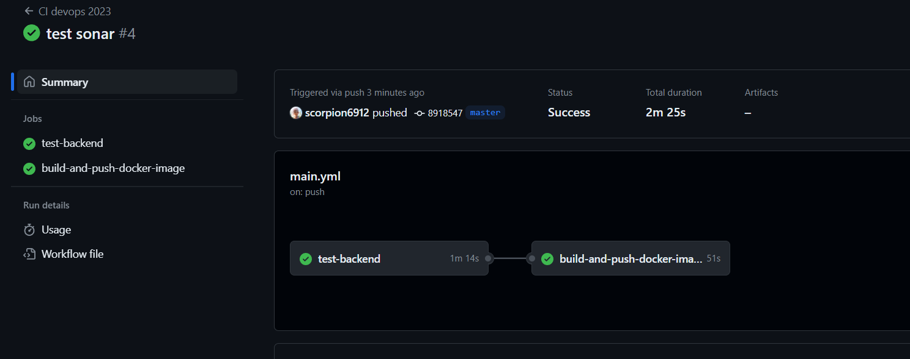

At the end, we can have defferents reports in Sonar on our project

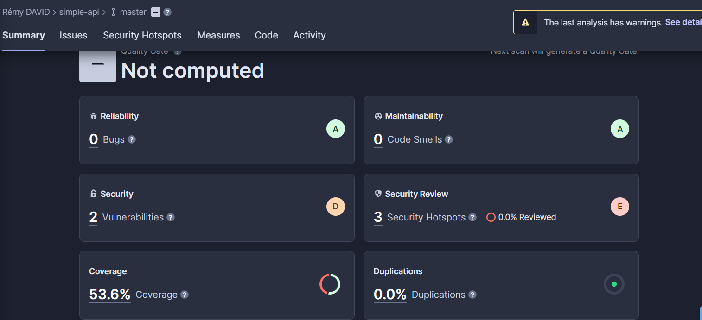

## Split pipelines 

We have to split into two differents jobs and files our pipeline.

The first for the backend tests :

```yml
name: test-backend

on:
  #to begin you want to launch this job in master and develop
  push:
    branches: [master, develop] 

jobs:
  test-backend: 
    runs-on: ubuntu-22.04
    steps:
     #checkout your github code using actions/checkout@v2.5.0
      - uses: actions/checkout@v2.5.0

     #do the same with another action (actions/setup-java@v3) that enable to setup jdk 17
      - name: Set up JDK 17
        uses: actions/setup-java@v3
        with:
          java-version: 17
          distribution: 'temurin'

     #finally build your app with the latest command
      - name: Build and test with Maven
        run: mvn -B verify sonar:sonar -Dsonar.projectKey=scorpion6912_devops-CPE -Dsonar.organization=scorpion6912 -Dsonar.host.url=https://sonarcloud.io -Dsonar.login=${{ secrets.SONAR_TOKEN }}  --file ./simple-api-student-main/pom.xml
```
And another for the build and push on dockerhub : 

```yml
name: build-and-push-docker-image

on:
  workflow_run:
    workflows:
      - test-backend
    types:
      - completed
    branches:
      - master

jobs:
 # define job to build and publish docker image
  build-and-push-docker-image:
    if: ${{ github.event.workflow_run.conclusion == 'success' }}
    # run only when code is compiling and tests are passing
    runs-on: ubuntu-22.04

    # steps to perform in job
    steps:
      - name: Checkout code
        uses: actions/checkout@v2.5.0

      - name: Login to DockerHub
        run: docker login -u ${{ secrets.DOCKERHUB_USERNAME }} -p ${{ secrets.DOCKERHUB_TOKEN }}

      - name: Build image and push backend
        uses: docker/build-push-action@v3
        with:
          # relative path to the place where source code with Dockerfile is located
          context: ./simple-api-student-main
          # Note: tags has to be all lower-case
          tags: ${{secrets.DOCKERHUB_USERNAME}}/tp2-devops-simple-api-student-main:latest
          # build on feature branches, push only on main branch
          push: ${{ github.ref == 'refs/heads/master' }}

      - name: Build image and push database
        uses: docker/build-push-action@v3
        with:
          context: ./dataBase

          tags: ${{secrets.DOCKERHUB_USERNAME}}/tp2-devops-database:latest
          push: ${{ github.ref == 'refs/heads/master' }}

      - name: Build image and push httpd
        uses: docker/build-push-action@v3
        with:
          context: ./http

          tags: ${{secrets.DOCKERHUB_USERNAME}}/tp2-devops-http-front:latest
          push: ${{ github.ref == 'refs/heads/master' }}

```
Here we are making sure that our deployement into docker hub only happend when a push is on master AND the backend tests are completed. 

To be more accurate, this is this code that does that : 
```yml
  workflow_run:
    workflows:
      - test-backend
    types:
      - completed
    branches:
      - master
```

Also this line : `if: ${{ github.event.workflow_run.conclusion == 'success' }}`

this line says that only succesfull tests can trigger the push on dockerHub, if the tests are completed but not successfull, the push will be skipped

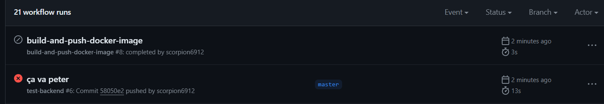

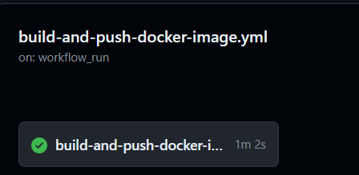

We can see here that our test is launched after the succes of the bakend tests. So we have successfully split our pipeline

# Partie 3 Ansible

```yml
all:
 vars:
   ansible_user: centos
   ansible_ssh_private_key_file: ~/.ssh/id_rsa
 children:
   prod:
     hosts: remy.david.takima.cloud
```

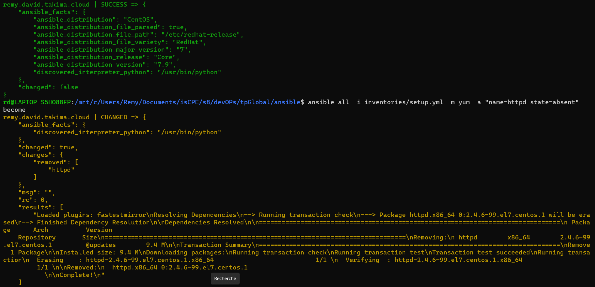

With the first playbook we have this result : 

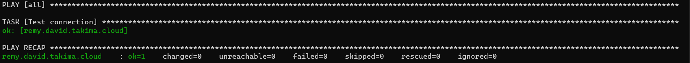

With the secound one the result is the following image : 

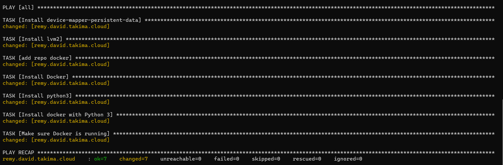

then we create a docker role : 

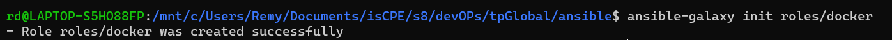

After creating the role, we have to modify the main.yml in the task folder for the role named docker : 

```yml
- name: Install device-mapper-persistent-data
  yum:
    name: device-mapper-persistent-data
    state: latest

- name: Install lvm2
  yum:
    name: lvm2
    state: latest

- name: add repo docker
  command:
    cmd: sudo yum-config-manager --add-repo=https://download.docker.com/linux/centos/docker-ce.repo

- name: Install Docker
  yum:
    name: docker-ce
    state: present

- name: Install python3
  yum:
    name: python3
    state: present

- name: Install docker with Python 3
  pip:
    name: docker
    executable: pip3
  vars:
    ansible_python_interpreter: /usr/bin/python3

- name: Make sure Docker is running
  service: name=docker state=started
  tags: docker

```

and the new playbook : 
```yml
- hosts: all
  gather_facts: false
  become: true

  roles:
  - docker
```

Here is the result : 

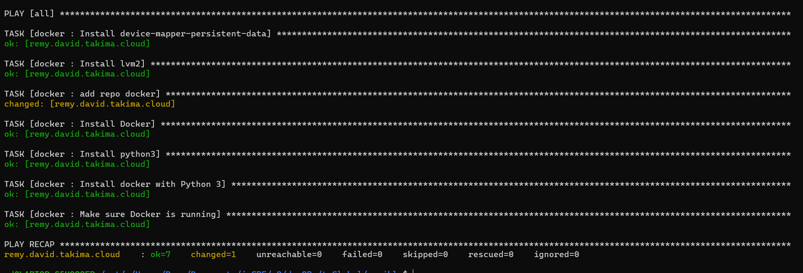

Then, we create roles : 
```bash
ansible-galaxy init roles/install-docker
ansible-galaxy init roles/create-network
ansible-galaxy init roles/launch-database
ansible-galaxy init roles/launch-app
ansible-galaxy init roles/launch-proxy
```

We also must update our setup.yml : 
```yml
all:
 vars:
   ansible_user: centos
   ansible_ssh_private_key_file: ~/.ssh/id_rsa
   URL: "tp1bdd:5432"
   POSTGRES_USER: "usr"
   POSTGRES_PASSWORD: "pwd"
   POSTGRES_DB: "db"
 children:
   prod:
     hosts: remy.david.takima.cloud
```

then we must modify our tasks files for every role to work as intended : 

```yml
- name: Create network
  community.docker.docker_network:
    name: networkDevops
    state: present
```

```yml
- name: Run backend
  community.docker.docker_container:
    name: simpleapistud
    networks:
    - name: networkDevops
    image: scorpion6912/tp2-devops-simple-api-student-main
    env:
      password: "{{ POSTGRES_PASSWORD }}"
      username: "{{ POSTGRES_USER }}"
      db: "{{ POSTGRES_DB }}"
      url: "{{ URL }}"
```

```yml
- name: Run DB
  community.docker.docker_container:
    name: tp1bdd
    networks:
    - name: networkDevops
    image: scorpion6912/tp2-devops-database:latest
    env:
      password: "{{ POSTGRES_PASSWORD }}"
      username: "{{ POSTGRES_USER }}"
      db: "{{ POSTGRES_DB }}"
      url: "{{ URL }}"
```

```yml
- name: Run HTTPD
  community.docker.docker_container:
    name: httpd-1
    networks:
    - name: networkDevops
    ports:
    - "80:80"
    image:  scorpion6912/tp2-devops-http-front
```
Finally, it's working as intended : 

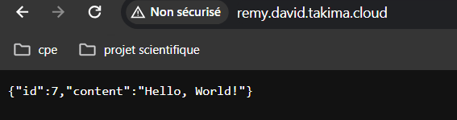

## Frontend

Here we have to add another container docker to handle our front end, first things first let's create another role in our ansible : launch-front 

Also, we must add a task :

```yml
- name: Run Front
  community.docker.docker_container:
    name: frontend
    pull: true
    recreate: true
    networks:
    - name: networkDevops
    image:  scorpion6912/tp2-devops-frontend
```

also modify our playbook : 

```yml
- hosts: all
  gather_facts: false
  become: true

  roles:
    - install-docker
    - create-network
    - launch-database
    - launch-app
    - launch-proxy
    - launch-front
```

We need to modify our docker-compose too : 

```yml
  frontend: 
    build:
      context: ./devops-front-main
    networks:
      - tp1
    depends_on:
      - backend
```

The next step is to add the new container into our CI/CD : 

```yml
      - name: Build image and push frontend
        uses: docker/build-push-action@v3
        with:
          context: ./devops-front-main

          tags: ${{secrets.DOCKERHUB_USERNAME}}/tp2-devops-frontend:latest
          push: ${{ github.ref == 'refs/heads/master' }}
```
Then we have to modify our proxy : 

```
<VirtualHost *:80>
    ServerName localhost
    ProxyPreserveHost On
    ProxyPass / http://frontend:80/
    ProxyPassReverse / http://frontend:80/
</VirtualHost>

Listen 8080
<VirtualHost *:8080>
    ServerName localhost
    ProxyPreserveHost On
    ProxyPass / http://simpleapistud:8080/
    ProxyPassReverse / http://simpleapistud:8080/
</VirtualHost>

LoadModule proxy_module modules/mod_proxy.so
LoadModule proxy_http_module modules/mod_proxy_http.so
```

The last step is to modify our prod environement in the frontend folder : 

`VUE_APP_API_URL=remy.david.takima.cloud:8080`

At the end, our front end is connected to the API : 

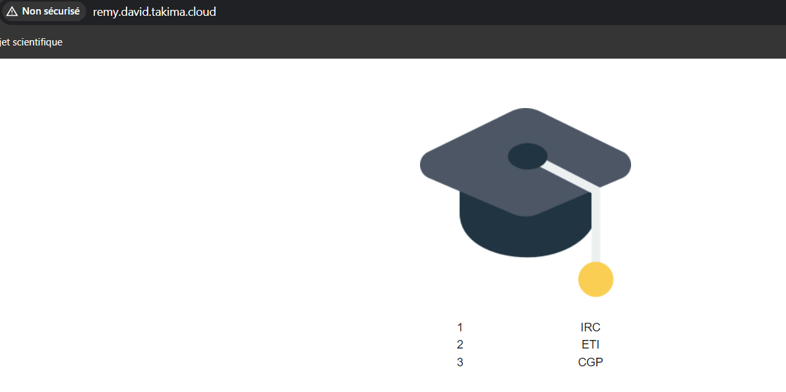

# CICD Ansible

WIP